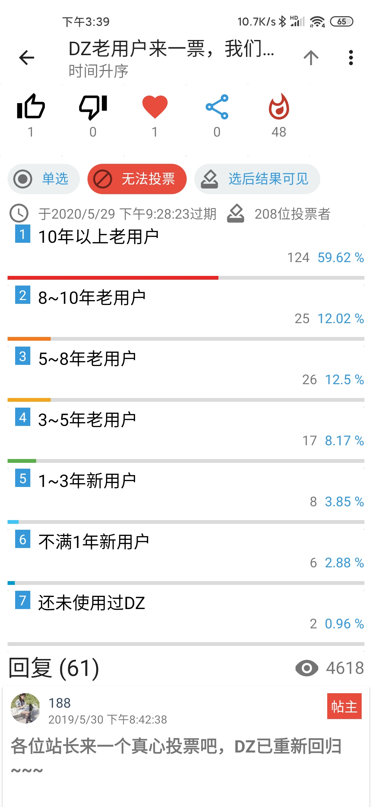

# DiscuzHub

Lightweight Discuz! android app

# Homepage

For detailed information, update and policy, please visit [our homepage](https://discuzhub.kidozh.com/en/)

[简体中文](./README_ZH.md)

# Features

+ App
	- Two basic login types: password and webpage
	- Multiple forums
	- Multiple accounts
	- Dark mode support
	- Notification overview
	- Hot thread and popular trend
+ Forum
	- Browse and read description
	- Filter by tag and category
	- See quick replies
+ Thread
	- Browse
	- Filter by author
	- Sort by time
	- Quick reply
	- Reply to author
	- Rich text support
	- Inline image render support
	- Data saver mode for image
	- Review images and download attachments
+ Post
	- Category type support
	- Image support
	- Meme support
	- Rich text support
	- Draft box auto-backup
	- Failure backup
	- Rich text support
	- Add, delete, clear or modify drafts
+ Notification
	- System push
	- Thread and post update
	- Public and private message view and reply
+ User
	- Basic information
	- HTML bio render
	- View friend, posts and thread
	- GIF avatar support
	- Inline webview
	- Auth freely
	- Full support for mobile BBS
	
# Screenshots

The forums below have no relationship with us and provide no warranty for any functions and support.

## Home

## Forums

## Threads of the forum

## Threads display

## Poll

## Notifications and pushes

# Open source license

MIT License